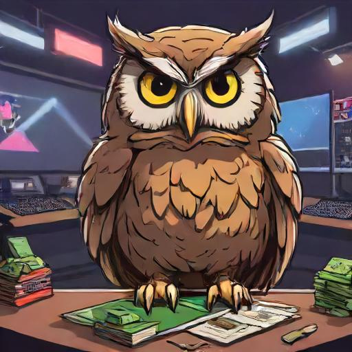

# Owl esports 

<!-- Logo -->
<p align="center">
  
</p>

## Build

To build the extension, run:
```bash	
bun run build
```
This will create a new folder called _build/_ with the extension files. The folder will contain the following files by default:
- Anything in _public/_ (images, styles, manifest etc.)
- .js and .ts files in _src/scripts/_
This folder can be loaded as an unpacked extension in your browser.
The files that end up in the build folder _build/_ are configured in _bundler.ts_.
